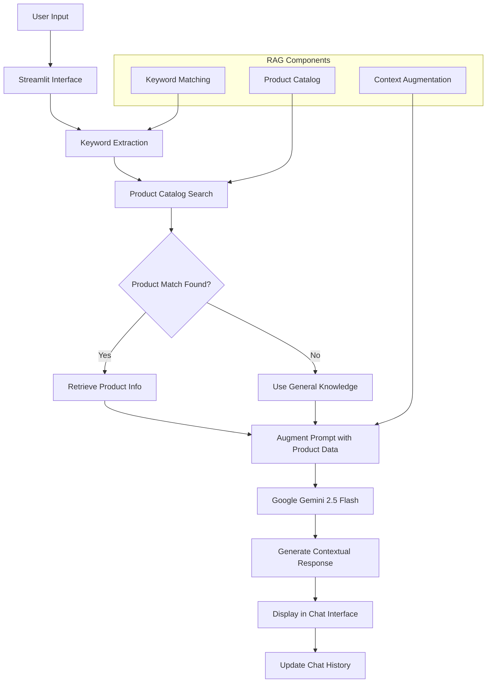

# FinAISalesChatbot
# Building an AI-Powered Financial Sales Assistant with Streamlit
## "Demo Fin-Tech Solutions: A Streamlit-Powered Financial Sales Assistant"

### Revolutionizing Client Interaction with a Smart Chatbot

Presented by: Mary


## UI Designed from Figma Prototype


# 💰 FinAI Sales Chatbot - Catalog-based RAG System

AI-powered sales assistance chatbot implementing Catalog-based RAG architecture for demo financial software companies. Built for websites lacking integrated AI assistants, providing contextually-aware product recommendations through semantic retrieval from pre-indexed product catalogs.

## 🌟 Features

- **Catalog-based RAG Architecture**: Pre-indexed product information with semantic retrieval
- **Google Gemini 2.5 Flash Integration**: Advanced LLM for natural conversation
- **Real-time Product Recommendations**: Context-aware suggestions based on user queries
- **Professional UI Design**: Figma-inspired design with custom CSS styling
- **Multi-page Website Structure**: Complete business website with integrated chatbot
- **Persistent Chat History**: Maintains conversation context throughout the session
- **Responsive Design**: Mobile-friendly interface with gradient backgrounds

## 🏗️ System Architecture



## 🚀 Quick Start

### Prerequisites

- Python 3.8+
- Google AI API Key
- ngrok account (for public access)

### Installation

1. **Clone the repository**
   ```bash
   git clone https://github.com/yourusername/finai-chatbot.git
   cd finai-chatbot
   ```

2. **Install dependencies**
   ```bash
   pip install -r requirements.txt
   ```

3. **Set up environment variables**
   ```bash
   export GOOGLE_API_KEY="your_google_ai_api_key_here"
   ```

4. **Run the application**
   
   **Option A: Local Development**
   ```bash
   streamlit run app.py
   ```
   
   **Option B: Public Access with ngrok**
   ```bash
   python main.py
   ```

## 📁 Project Structure

```
finai-chatbot/
├── app.py                  # Main Streamlit application
├── main.py                 # ngrok integration for public access
├── requirements.txt        # Python dependencies
├── README.md              # Project documentation
└── assets/                # Images and static files
```

## 💡 How It Works

### RAG Implementation

1. **Product Catalog Setup**: Pre-defined demo financial products with descriptions and features
2. **Keyword Extraction**: Analyzes user input for demo product-related terms
3. **Semantic Retrieval**: Matches keywords with demo product catalog entries
4. **Context Augmentation**: Enhances LLM prompt with relevant demo product information
5. **Response Generation**: Google Gemini generates contextually-aware responses

### Example Demo Product Catalog

```python
products = {
    "demo-budget-pro": {
        "name": "Demo Budget Pro",
        "description": "Advanced personal and small business finance management",
        "features": ["Expense tracking", "Income categorization", "Monthly reports"]
    },
    "demo-invest-wise": {
        "name": "Demo InvestWise", 
        "description": "AI-powered stock market analysis and portfolio management",
        "features": ["Real-time data", "Risk assessment", "Diversification advice"]
    }
}
```

## 🛠️ Tech Stack

- **Frontend**: Streamlit with custom CSS
- **LLM**: Google Gemini 2.5 Flash
- **RAG Implementation**: Custom keyword-based retrieval
- **Deployment**: ngrok for public access
- **Language**: Python 3.8+

## 📋 Requirements

```txt
streamlit>=1.28.0
google-generativeai>=0.3.0
pyngrok>=6.0.0
```

## 🎨 UI Features

- **Gradient Background**: Professional purple-to-blue gradient
- **Responsive Navigation**: Multi-page website structure
- **Custom Chat Interface**: Styled chat bubbles and sidebar
- **Mobile-Friendly**: Responsive design for all devices

## 🔧 Configuration

### Environment Variables

| Variable | Description | Required |
|----------|-------------|----------|
| `GOOGLE_API_KEY` | Google AI API key for Gemini model | Yes |

### Getting API Key

1. Visit [Google AI Studio](https://makersuite.google.com/app/apikey)
2. Create a new API key
3. Set it as an environment variable

## 📊 Usage Examples

**User Query**: "Tell me about budget management tools"

**System Process**:
1. Extracts keywords: ["budget", "management", "tools"]
2. Matches with "budget-pro" product
3. Retrieves product information
4. Augments prompt with product details
5. Generates contextual response about Budget Pro features

## 🚀 Deployment

### Local Development
```bash
streamlit run app.py
# Access at http://localhost:8501
```

### Public Access
```bash
python main.py
# Generates public ngrok URL
```

## 🎯 Target Market

**Built for:**
- Financial software companies without AI chatbots
- Businesses needing instant product assistance
- Websites requiring sales automation
- Companies wanting to retrofit existing sites with AI

**Use Cases:**
- Product information and recommendations
- Lead generation and qualification
- Customer support automation
- Sales process enhancement

## 🤝 Contributing

1. Fork the repository
2. Create a feature branch: `git checkout -b feature-name`
3. Commit changes: `git commit -am 'Add feature'`
4. Push to branch: `git push origin feature-name`
5. Submit a pull request

## 📄 License

This project is licensed under the MIT License - see the [LICENSE](LICENSE) file for details.

## 🔮 Future Enhancements

- Vector database integration for better semantic search
- Multi-language support
- Analytics dashboard for conversation insights
- Integration with CRM systems
- Advanced lead scoring

---

*FinAI Chatbot: Bringing AI-powered sales assistance to businesses without existing chatbot infrastructure.*

### The Challenge
Problem: How do we create a dynamic, modern, and interactive platform to showcase our financial software products and provide immediate client support?

Solution: A web application built with Streamlit, featuring a powerful AI assistant.

### Our Technology Stack
This project combines powerful, flexible, and free tools to deliver a robust solution.

Streamlit: The core of our front-end. It allows us to build and deploy data-driven web applications quickly using pure Python.

Google Gemini 2.5 Flash: The brain of our chatbot. This large language model provides fast, high-quality responses for a seamless user experience.

Custom CSS: Used to style the application to match our brand, providing a clean and professional look.

Key Features of the Application
We've built a user-friendly and functional platform with three main components.

Modern Website Interface: A multi-page layout with a sleek design. The navigation bar and dark theme create a premium feel.

Reactive UI: The interface is built to respond dynamically. Clicking on a navigation button instantly changes the page content without a full refresh, providing a smooth user experience.

Integrated AI Chatbot: The chatbot is neatly integrated into the sidebar, offering instant assistance and product information. It’s always available but doesn’t clutter the main content area.

### The Chatbot in Action
The chatbot is more than a simple Q&A tool.

Contextual Understanding: It uses Retrieval-Augmented Generation (RAG) to provide accurate information. When a user asks about a product, the chatbot first checks our internal product catalog to find relevant data.

Personalized Responses: It uses the retrieved information to craft a helpful, context-aware answer.

Professional Persona: The chatbot's initial system prompt ensures it behaves like a professional and helpful financial sales assistant.
